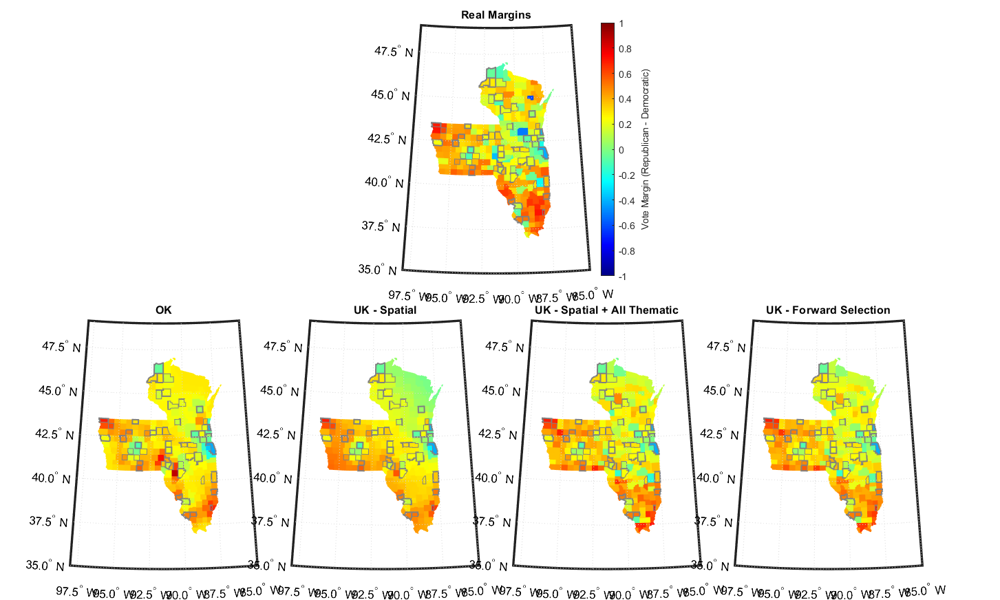

# Estimating County-Level Vote Margins using Kriging with Spatial Covariates

This project explores the use of spatial statistical methods to model and predict county-level vote margins from the 2024 U.S. presidential election. We apply Kriging-based spatial interpolation techniques to understand how geographic and socio-economic factors contribute to voting behavior.

We compare:
- **Ordinary Kriging (OK)** — assuming a constant mean.
- **Universal Kriging (UK)** — incorporating spatial trends and socio-economic covariates.
- **Universal Kriging with Forward Selection (UK-FS)** — systematically selecting the most predictive covariates.

Socio-economic covariates considered include:
- Population density
- Educational attainment (Some College, High School Graduation)
- Unemployment rate
- Severe Housing Cost Burden
- Child Care Cost Burden
- Voter Turnout

**Model evaluation** was conducted using **5-fold cross-validation**, with performance measured by RMSE and R². Residual diagnostics and spatial maps were used to assess model quality.

---

## Example Results

### Actual vs Predicted Margins

---

Our results show that incorporating socio-economic covariates substantially improves spatial predictions of vote margins, with **Severe Housing Cost Burden**, **Population Density**, and **Educational Attainment** emerging as the most influential factors.

---
